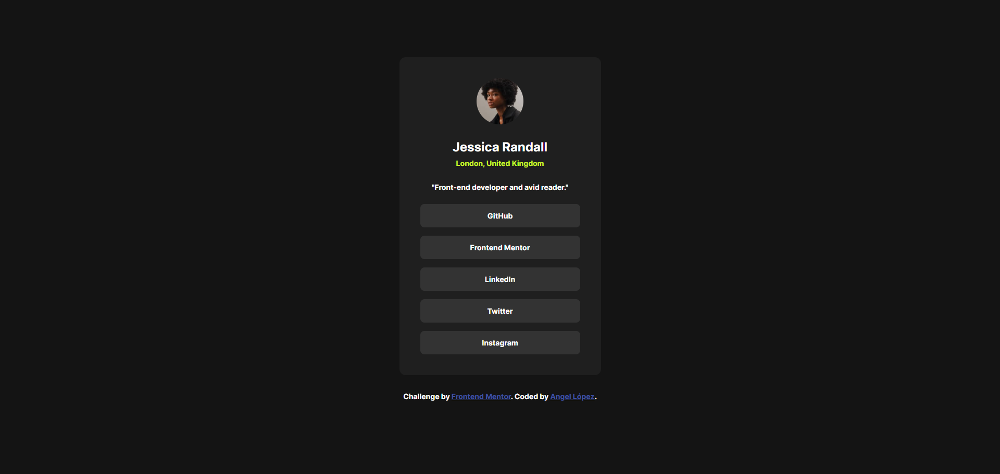

# 👤 Frontend Mentor - Solución del reto Social links profile

Esta es mi solución al reto [Social links profile en Frontend Mentor](https://www.frontendmentor.io/challenges/social-links-profile-UG32l9m6dQ).

## Tabla de contenidos

- [Resumen](#resumen)
  - [El reto](#el-reto)
  - [Captura de pantalla](#captura-de-pantalla)
  - [Enlaces](#enlaces)
- [Mi proceso](#mi-proceso)
  - [Construido con](#construido-con)
  - [Lo que aprendí](#lo-que-aprendí)
  - [Desarrollo continuo](#desarrollo-continuo)
  - [Recursos útiles](#recursos-útiles)
- [Autor](#autor)
- [Agradecimientos](#agradecimientos)

## 💻 Resumen

### El reto

Los usuarios deberían poder:

- Ver los estados de hover y focus en todos los elementos interactivos de la página

### Captura de pantalla



### Enlaces

- URL de la solución: https://github.com/angeldavid04/social-links-profile
- URL del sitio en vivo: https://angeldavid04.github.io/social-links-profile/

## 💪 Mi proceso

### Construido con

- HTML5 semántico
- Propiedades personalizadas de CSS
- Flexbox

### Lo que aprendí

Mejoré mis habilidades en el acomodo de elementos, también como implementar propiedades personalizadas para guardar valores de tamaño de fuente y espaciado de elementos, lo cual me parece un agregado bastante útil para organizar el código CSS, y así no se haga una maraña de valores mágicos.

```css
:root {
  /* TYPOGRAPHY */
  --text-sm: 0.875rem;
  --text-md: 1.5rem;
  --fw-sm: 400;
  --fw-md: 600;
  --fw-lg: 700;
  /* ... */
}
```

### Desarrollo continuo

Me gustaría seguir perfeccionando mis habilidades de maquetado enfocandome en los fundamentos, para en un futuro poder transicionar a un framework cuando me sienta preparado para ello.

### Recursos útiles

- [MDN Web Docs](https://developer.mozilla.org/es/) - Este recurso es muy bueno y me ayuda sobre todo a escoger funciones y características que funcionan en cualquier navegador.

## 🤓 Autor

- Frontend Mentor - [Angel López](https://www.frontendmentor.io/profile/AngelDavid-dev)

## ♥️ Agradecimientos

Le quiero dar un agradecimiento a mi maestros del bachillerato porque sin ellos no fuera quien soy ahora, JonMircha por ser un gran docente digital y enseñarme los fundamentos del desarrollo web, y a Lucas Dalto por ofrecerme muy buenos cursos para aprender y repasar.
